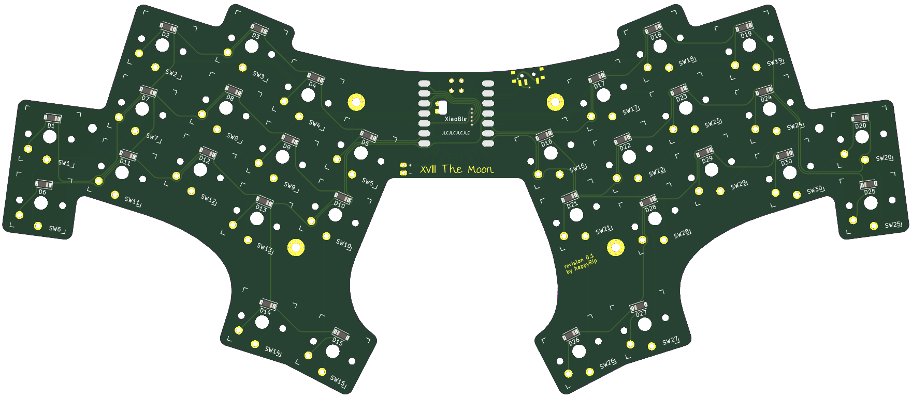

# XVIII The Moon

## Table of Contents
- [XVIII The Moon](#xviii-the-moon)
  - [Table of Contents](#table-of-contents)
  - [Design principles](#design-principles)
    - [Decreased key count](#decreased-key-count)
    - [Size conscious](#size-conscious)
    - [Thoughtful ergonomics](#thoughtful-ergonomics)
    - [Seeed Xiao footprint](#seeed-xiao-footprint)
    - [Wireless](#wireless)
    - [Low cost](#low-cost)
  - [Resources](#resources)
    - [Bill of materials](#bill-of-materials)
    - [Build guide](#build-guide)

## Design principles

`The Moon` or `xviii` is an ergonomic unibody keyboard, which/whose main
principles are:

### Decreased key count

30 keys is the minimal amount to cover all 26 letters of latin alphabet plus
4 additional utility keys to make it usable as a main input device.

### Size conscious

The keyboard only supports Kailh PG1350 Choc swithces and is designed with
*choc spacing* in mind. This makes `the moon`'s footprint pretty minimal so the
keyboard takes little desk space as well as can easily be carried with in
a backpack (preferably use a carrying case/bag too, I've heard stethoscope
cases work fine that regard).

### Thoughtful ergonomics

Aggressive pinky stagger combined with ring and pinky column splay make this
layout fit like a glove... for me. Each hand is different and that is why you
can test this layout out with [printed]() or, if you own the switches and
keycaps already, [3d printable]() layout tester. The layout is basically
a [`bugs/flea`](https://github.com/jimmerricks/bugs#flea-v01) unibody (with
a little less pinky splay on the `xviii` though). 

### Seeed Xiao footprint

The heart of this keyboard is a cheap and aesthetically pleasing
microcontroller with only 11 general purpose I/O pins. This limits the matrix
size to only 5 by 6 (exactly 30 keys, what a coincidence). The tradeoff is that
diodes are required for each switch in this build.

### Wireless

Recently `Seeed Xiao BLE` joined the `Xiao` family. This makes it possibe to
use an ultra-small size development board module, which is easy to solder and
affordable. Unibody design means that only a single microcontroller is needed
to drive the whole board, which means lower power consumption and price.

### Low cost

With fewer keys and a tiny MCU the price of this build is relatively low. Apart
from the PCB you only need 30 switches, diodes and keycaps, one microcontroller
and a power switch + battery for a wireless build. This makes the total cost of
the board start at around \$70 excluding PCB and shipping. The detailed BOM and
build instructions can be found below (WIP).

## Resources

### Bill of materials

| Component                  | Amount |
|:---------------------------|-------:|
| Seeed Xiao BLE             |      1 |
| Kailh Choc PG1350          |     30 |
| Diode (1n4148w SOD-123)    |     30 |
| Keycaps (choc spacing)     |     30 |
| 3.7v Lipo Battery (402530) |      1 |
| Power Switch (MSK-12C02)   |      1 |

### Build guide

**WIP**
